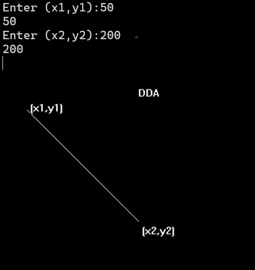

# Digital Differential Analyzer Algorithm
# ALGORITHM
        1. Start.
        ∆ y = m ∆ x
        y2-y1 = m (x2-x1)
        2. Declare variables x,y,x1,y1,x2,y2,k,dx,dy,s,xi,yi and also declare
        gdriver=DETECT, mode.
        3. Initialize the graphic mode with the path location in TurboC3 folder.
        4. Input the two line end-points and store the left end-points in (x1,y1).
        5. Load (x1, y1) into the frame buffer; that is, plot the first point. put x=x1,y=y1.
        6. Calculate dx=x2-x1 and dy=y2-y1.
        7. If abs (dx) > abs (dy), do s=abs(dx).
        8. Otherwise s= abs(dy).
        9. Then xi=dx/s and yi=dy/s.
        10. Start from k=0 and continuing till k<s,the points will be
        i. x=x+xi.
        ii. Y=y+yi.
        11. Plot pixels using putpixel at points (x,y) in specified colour.
        12. Close Graph and stop.
# OUTPUT

# CONCLUSION
In the lab, we draw the line using the DDA algorithm.
